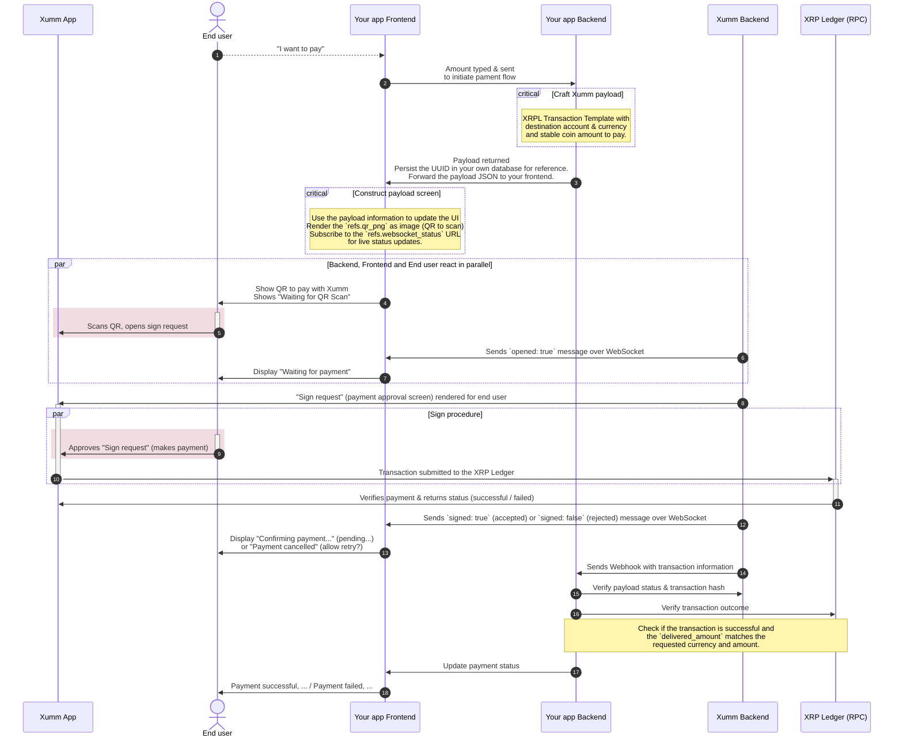

# Sample POS lifecycle

```mermaid
sequenceDiagram
    autonumber

    participant app as Xumm App
    actor user as End user
    participant frontend as Your app Frontend
    participant backend as Your app Backend
    participant xumm as Xumm Backend
    participant xrpl as XRP Ledger (RPC)

    user-->>frontend: "I want to pay"
    frontend->>backend: Amount typed & sent<br />to initiate pament flow
    
    critical Craft Xumm payload
        Note over backend: XRPL Transaction Template with<br />destination account & currency<br />and stable coin amount to pay.
    end
    backend->>frontend: Payload returned<br />Persist the UUID in your own database for reference.<br />Forward the payload JSON to your frontend.
    
    critical Construct payload screen
        Note over frontend: Use the payload information to update the UI<br />Render the `refs.qr_png` as image (QR to scan)<br />Subscribe to the `refs.websocket_status` URL<br />for live status updates.
    end

    par Backend, Frontend and End user react in parallel
        frontend->>user: Show QR to pay with Xumm<br />Shows "Waiting for QR Scan"
        rect rgb(240, 220, 225)
            activate user
                user->>app: Scans QR, opens sign request
            deactivate user
        end
        xumm->>frontend: Sends `opened: true` message over WebSocket
        frontend->>user: Display "Waiting for payment"
    end
    
    xumm->>app: "Sign request" (payment approval screen) rendered for end user
    activate app
    par Sign procedure
        rect rgb(240, 220, 225
            activate user
                user->>app: Approves "Sign request" (makes payment)
            deactivate user
        end
        app->>+xrpl: Transaction submitted to the XRP Ledger
    end

    deactivate app

    xrpl->>-app: Verifies payment & returns status (successful / failed)

    xumm->>frontend: Sends `signed: true` (accepted) or `signed: false` (rejected) message over WebSocket
    frontend->>user: Display "Confirming payment..." (pending...)<br />or "Payment cancelled" (allow retry?)

    xumm->>backend: Sends Webhook with transaction information
    backend->>xumm: Verify payload status & transaction hash
    backend->>xrpl: Verify transaction outcome
    Note over backend,xrpl: Check if the transaction is successful and<br />the `delivered_amount` matches the<br />requested currency and amount.
    backend->>frontend: Update payment status

    frontend->>user: Payment successful, ... / Payment failed, ...
```

