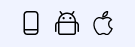
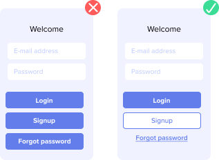
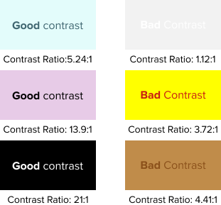
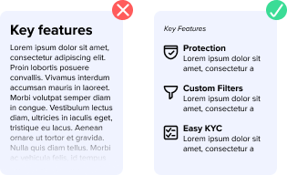

# Requirements

xApps are WebApps, embedded in Xumm for a great user experience. They add value (tooling, wizards) for end users, using Sign Requests and their Web UI to help users perform tasks on the XRPL and beyond.

* Anyone can create sandbox xApp
* Only you can use your own sandbox xApp from a specific Xumm installation you can whitelist after activating xApp features.
* The fact that you got a sandbox xApp is not to be presented anywhere as an endorsement (e.g. in communication like on social media, etc.))
* To build an xApp, you need to have experience with Frontend Web Development as xApps are WebApps (loaded in Xumm)
* xApps need to add value to a significant share of the Xumm user base
* xApps need to be self explanatory to have clear instructions for end users
* xApps need to be designed in a way where users can not make dangerous mistakes: users need to be protected
* xApps developers can not be anonymous (accountability)
* Promotion of speculation, pushing users towards buying tokens is not allowed (see: user protection)
* Activating xApp features and building a sandbox xApp does NOT guarantee your xApp will be going live in the future. To take your xApp live, it will be audited by XRPL Labs. The rules above apply, security & usability will be tested. If you want to have more certainty in advance, please [reach out](mailto:support@xrpl-labs.com).

## All xApps

* The xApp should be self explanatory, or do a good job explaining to the users what the xApp offers in the very first screen the xApp shows
* xApps can not be designed in a way where it it completely unclear to end users if they are using a third party developed xApp or a XRPL Labs maintained component
* xApps must not be a regular website/webapp fitted in an xApp: the user experience must be to seme degree tailored to users in Xumm, and must have relevance for Xumm users
* xApps must not be in violation with Apple and Google App Store / Play Store requirements. For example, unlocking features based on NFTs owned is not allowed.

## Technical

* All links to external sites / window opens must be replaced by a `openBrowser` call on the Xumm SDK: [xumm-ui-interaction.md](xumm-ui-interaction.md "mention") so that users won't reach another website through navigating in the xApp
* Reliable user-bound storage is available not through cookies / localStorage, but through the Xumm `userstore`: [xumm.userstore](../../js-ts-sdk/sdk-syntax/xumm.userstore "mention")
* No polling should be used: to retrieve the status of a payload, use the websocket we provide for status updates (or the `createAndSubscribe` / `subscribe` method provided by the SDK: [createandsubscribe.md](../../js-ts-sdk/sdk-syntax/xumm.payload/createandsubscribe.md "mention") / [createandsubscribe.md](../../js-ts-sdk/sdk-syntax/xumm.payload/createandsubscribe.md "mention")). Backend applications can also use a webhook: [webhooks](../../concepts/payloads-sign-requests/status-updates/webhooks/ "mention").

## Accessibility&#x20;

* Simple accessible navigation&#x20;
* Clear icons:\
  .png>)
* Reduce clutter: Keep minimum content on screen&#x20;
* Use accessible fonts\
  
* Use minimal of 16pt font for standard **body text**
* Test on different devices:\
  
* Manage information on a logical level
* Consistency in design
* Use a 40x40px target area for touch controls
* Good (horizontal) alignment:\
  .png>)
* Distinction between primary and secondary Buttons:\
  
* Clear error text:\
  
* Appropriate color contrast:\
  
* No slang or bad grammar. Use proper English.&#x20;
* Human like language:\
  
* Breaking up content:\
  

Accessibility Tools:

* Contrast checker link 1: [https://accessibleweb.com/color-contrast-checker](https://accessibleweb.com/color-contrast-checker/)
* Contrast checker link 2: [https://contrastchecker.com/](https://contrastchecker.com/)
* Iconset: [https://feathericons.com/](https://feathericons.com/)

## Styling

* xApps should either have their own colour scheme (dark/light mode independent) or respect the Xumm colour schemes: [style-guide.md](style-guide.md "mention"). The end user styling will be passed to the xApp using the `xAppStyle` query parameter.
* The xApp `<html>` and `<body>` tag must have a `transparent` background color right upon page load, so the xApp doesn't 'flicker' white while loading, until styling has been applied (rendered by the browser).

## Sandboxed xApps

* Full access, no restrictions, but only for the developer and max. 10 testers (whitelisted by Device UUID in the Xumm Developer Console)

## Link (QR/Deeplink) only xApps

* The xApp should look appealing
* The xApp should respect different Xumm user screen sizes
* The xApp should be well crafted: it should be clear what the xApp will do, and it should do what the xApp promised to do
* The xApp should have a clear Support workflow & offer terms & conditions & a privacy statement

## Public (listed) xApps

* The xApp should not be a "launchpad" to something that could be perfectly located at a website: if there is no actual Xumm wallet/XRPL interaction where the integration with Xumm adds value, it should be a website, not an xApp
* Offer value (features people will appreciate/need) for a large part of the XRPL / Xumm user base
* The frontend source code must either be open source, shared (under NDA) with XRPL Labs for review or a third party security audit (code & dependencies + dependency update procedures) acceptable by XRPL Labs has to be provided.
