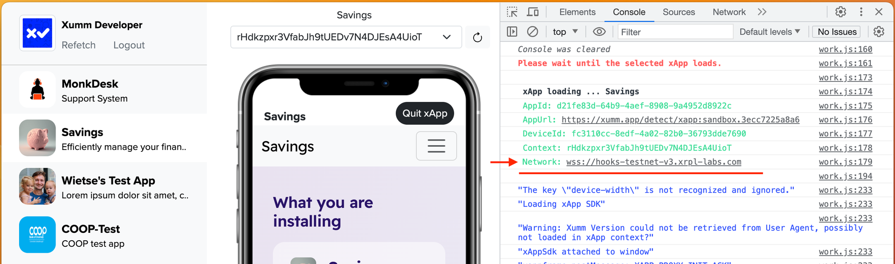

# xAppBuilder FAQ

**Q: I do not see my xApp in the xAppBuilder. What should I do?**

**A:** Ensure your Device ID has been entered in the Debug Device ID section.

* **Step 1:** Retrieve your Device ID from Xumm by going to Xumm -> Settings -> Advanced -> Device ID (double tap to copy it).
* **Step 2:** Visit [Xumm Developer Console](https://apps.xumm.dev/), select your application, navigate to the xApp section, and paste the Device ID you copied in Step 1 into the Debug Device ID section.

If you are not the owner of the xApp, you will need to ask the owner to input your Device ID in the Guest Device IDs section.

<figure><figcaption></figcaption></figure>

**Q: Why are some of my xApps shown in gray at the end of the xApp list in xAppBuilder?**

**A:** These xApps are ones you have not actively used, and their session has expired. To start a new session, open the xApp in Xumm and quit. Next, click on the "Refetch" link in xAppBuilder. This should fetch the active session of your xApp into xAppBuilder.

<figure><figcaption></figcaption></figure>

**Q: How can I open the xApp on xAppBuilder with a different context / r-address?**

**A:** Start by opening the xApp in Xumm with the different context / r-address, which will create a new session for the new context / r-address. Then return to xAppBuilder and click on the "Refetch" link. The new context / r-address should now be listed in the context dropdown menu.

<figure><figcaption></figcaption></figure>

**Q: How do I exit / close the xAppBuilder?**

**A:** On MacOS, hover over the top left corner to find the close, minimize, and maximize buttons. On Windows and Linux, click on the x symbol in the top right corner.&#x20;

<figure><figcaption></figcaption></figure>

For Mac users, you can also use Shift + Click on the tray icon to exit.

<figure><figcaption></figcaption></figure>

<figure><figcaption>
Location of the URL for switching networks in xApp Builder
</figcaption></figure>
